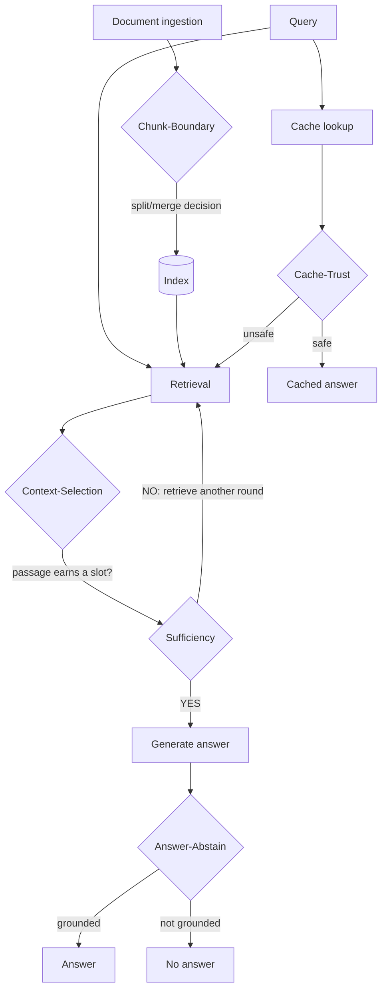

# JevRAG

**A common decision substrate for RAG (retrieval-augmented generation) pipelines** — a shared abstraction, a swappable decision backend, and a calibration-first evaluation harness.

```
state → Decision → confidence → action
```

  

| Decision | Shape | Status |
|---|---|---|
| [evidence-sufficiency](#evidence-sufficiency-n700-test-questions--the-headline-result) | iterative, multi-round | ✅ Built · evaluated (val n=300, test n=700) |
| [chunk-boundary](#chunk-boundary--the-generalization-test) | one-shot, pre-retrieval | ✅ Built · evaluated · generalization hash-proven |
| [context-selection](#context-selection--wrapped-vs-rebuilt-on-two-real-benchmarks) | one-shot, per-passage | ✅ Wrap + from-scratch rebuild, both evaluated |
| [answer-abstain](#answer-abstain--a-post-generation-grounding-check-benchmarked-against-a-free-alternative) | one-shot, post-generation | ✅ Built · benchmarked against a free alternative |
| [cache-trust](#cache-trust--extracted-from-real-prior-art-independently-corroborated) | one-shot, structural state | ✅ Extracted · independently corroborated |
| [the real pipeline](#the-real-pipeline) | all five, chained | ✅ Live · two real end-to-end runs, CRC-opt-in verified |
| [CRC calibration layer](#the-crc-calibration-layer) | per-decision threshold | ✅ Built · one real bug found, fixed, and disclosed |
| [a second Decision backend](#a-second-decision-backend) | logprob, zero-cost | ✅ Built · proves the abstraction generalizes to backends too |
| [shadow / observe mode](#shadow-observe-mode) | challenger comparison | ✅ Built · real what-if run against production |

**Jump to:** [The idea](#the-idea) · [Quickstart](#quickstart) · [What's built](#whats-actually-built-and-proven-so-far) · [Full CLI](#the-full-cli-all-five-primitives) · [Results](#results) · [The real pipeline](#the-real-pipeline) · [Reproducing this](#reproducing-this) · [Project layout](#project-layout)

---

## The idea

Every RAG pipeline has moments where it has to decide something mid-flight:
is this chunk of text a coherent unit or should it be split, is the evidence
gathered so far enough to answer the question, which retrieved passages
actually earn a slot in the context window, is a cached answer safe to
reuse, does the generated answer actually stay grounded in the evidence.
Most systems make these calls with a hardcoded threshold or a heuristic
buried somewhere in the code, untested and unmeasured.

JevRAG's idea is to make each of these a first-class, explicit decision:
hand a decision backend the relevant state, get back a typed answer with a
calibrated confidence, and let the calling code decide what to do with that
confidence rather than letting the model decide silently. The decision
backend itself is swappable — a different model, a trained classifier, a
simple rule — behind one interface. Jev, a decision-focused model from
TypeSafe AI, is the first backend actually wired up; it is not the point of
the project. The point is the substrate and, just as importantly, an
evaluation harness that reports honestly on whether a decision's confidence
means anything, rather than trusting a vendor's claim about it.

**Where the five decisions sit in a RAG pipeline** — this is the real,
wired architecture (each box below is one `Decision` call). It's live:
`jevrag/pipeline.py` chains all five end to end, verified on real
documents (see [The real pipeline](#the-real-pipeline) in Results):



*Diamonds are the five `Decision` calls this repo evaluates; the cache path
is a separate, parallel short-circuit, not a step inside the main flow.*

---

## Quickstart

What you need:

- Python 3.11+
- **HotpotQA data, only if you want to work with that dataset specifically**
  — the frozen 1000-question val/test split and prebuilt BM25 index this
  project's sufficiency/chunk-boundary/context-selection results were
  measured on currently live in a private, unpublished research checkout,
  not (yet) independently downloadable. The risk-coverage/AURC math and
  EM/F1 scoring themselves are vendored directly into this package
  (`jevrag/_vendor/`, with attribution) — installing and running `jevrag`,
  including the calibration harness itself, needs no external checkout
  at all. Only code that loads the actual HotpotQA question set
  (`jevrag/benchmarks/hotpotqa.py`, and by extension `scripts/produce_records.py`)
  looks for that data, at `D:\Research\RAG-Gate` by default, overridable
  via `RAG_GATE_PATH`. Every other primitive (chunk-boundary,
  context-selection, answer-abstain, cache-trust) and the abstraction
  itself run and test fine without it.
- A **Jev API key** (TypeSafe AI) — needed to generate fresh records.
  Not needed if you're only evaluating records someone already gave you.
- An **OpenRouter key**, only if you want to generate your own fresh
  records rather than evaluate existing ones — it's the answer generator.

```bash
git clone https://github.com/ajanm007/jevrag.git
cd jevrag
pip install -e .
```

Create a `.env` file at the repo root with your keys:

```
JEV_API_KEY=sk-...
OPENROUTER_API_KEY=sk-or-...
```

**Fastest path to real numbers — generate a small batch, then evaluate it:**

```bash
python scripts/produce_records.py --split val --limit 20
jevrag eval sufficiency --dataset hotpotqa \
    --records records/sufficiency_hotpotqa_val.jsonl \
    --baseline-records records/fixed_iter3_hotpotqa_val.jsonl \
    --split val
```

The first command makes real Jev + generator calls for 20 HotpotQA
questions (cheap — a few cents) and writes two JSONL files under
`records/`. The second reads them back and prints the full report:
accuracy, calibration (ECE/Brier), a risk-coverage table, and a cost
breakdown — the same report shape the full n=700 results below came
from, just on a smaller, faster sample. Drop `--limit 20` (and switch
`--split val` to `--split test`) to reproduce the real headline numbers,
though that means the full 700-question run.

No Jev key yet? The `jevrag eval` commands never call a model
themselves — they only read a records file and report on it — so if you
already have a records file from someone else's run (`records/` and
`outputs/` aren't committed to this repo, since they're regenerated
output, but they're easy to share directly), you can run the eval step
immediately without any key at all.

---

## What's actually built and proven so far

**All five originally-scoped decisions are built end-to-end and evaluated
for real**, on the identical `Decision` abstraction and the identical
calibration harness, with zero modifications to either required by any of
them — verified by cryptographic hash comparison (sha256 of every
protected module, before and after each new primitive's first live run),
not just by claim. All five now run through one unified CLI.

- **evidence-sufficiency** — given a question and the evidence retrieved so
  far, is that enough to answer, or should retrieval run another round? An
  *iterative, multi-round* stopping decision, asked after every retrieval
  round.
- **chunk-boundary** — given a candidate split point in a document, is this
  a coherent boundary or should the text stay merged? A *one-shot,
  pre-retrieval* decision, the structural opposite of sufficiency's loop.
- **context-selection** — given a retrieved candidate passage, does it earn
  a slot in the context sent to the generator? A *one-shot, per-item
  filter/select* decision — evaluated two ways (see below).
- **answer-abstain** — given the question, the retrieved evidence, and the
  answer the generator actually produced, does that answer stay grounded in
  the evidence, or should it be suppressed? A *one-shot, post-generation*
  grounding check — the only one that looks at generated output rather
  than input.
- **cache-trust** — given a semantic-cache hit, is the cached answer safe to
  serve, or should the system regenerate? A *one-shot* decision over purely
  structural state (similarity score, entry age, scoping — never the
  cached content itself, by design). Extracted from real, shipped prior art
  and independently corroborated by a second, blind design attempt that
  converged on the same architecture without ever seeing the first.

Concretely, what exists:

- **A `Decision` protocol** (`jevrag/decision.py`) — `ask(state, questions) ->
  DecisionResult`, with Jev as the live backend and a swappable interface
  verified by plugging in a second, trivial backend without touching anything
  else. Also verified against a non-text, purely structural state and a
  multi-question single call — neither assumption held only for text-shaped,
  single-question decisions.
- **Five primitives** (`jevrag/primitives/`) — `sufficiency.py`,
  `chunk_boundary.py`, `context_selection.py`, `answer_abstain.py`,
  `cache_trust.py` (plus `cache_safety_check.py`, an independently-designed
  second implementation of the cache-trust decision, built blind without
  reading the first — see Results below).
- **A calibration-first evaluation harness** (`jevrag/eval/`) — computes AURC
  and risk-coverage curves (a standard method from the selective-prediction
  literature for scoring how well a confidence signal separates likely-correct
  from likely-wrong answers), plus ECE, MCE, Brier score and Brier skill score
  (standard calibration metrics: is a stated confidence of 0.9 actually right
  about 90% of the time?). This harness is what turns "the model said it was
  confident" into a number you can actually trust or distrust — and it is the
  same code, unmodified, behind every one of the five primitives above.
- **A fixed-iteration baseline** (`jevrag/baselines/fixed_iteration.py`) — the
  same retrieval and generation stack with the gate disabled, always running a
  fixed number of rounds. This is what the gated sufficiency version has to
  beat, or at least match more cheaply.
- **Two wrapped/reproduced external comparisons** — a real, third-party
  package (`rag-jev`, PyPI) wrapped via adapter for context-selection, and a
  real, independently-run reproduction of its own published benchmark result
  (see Results below); and a free, logprob-based confidence signal (`rag-gate`)
  benchmarked directly against answer-abstain on identical ground truth.
- **HotpotQA benchmark wiring** — a public multi-hop question-answering
  dataset, with a frozen 300/700 validation/test split, scored with standard
  exact-match and F1 metrics.
- **BEIR/SciFact benchmark wiring** — a scientific claim-verification
  retrieval benchmark, used specifically to reproduce and compare against a
  real external package's own published result on its own home benchmark,
  not just on a dataset of convenience.
- **DocBench wiring** (`jevrag/benchmarks/docbench.py`) — a second,
  structurally different document benchmark (real PDFs, not short-span QA).
  Used to independently test all five primitives on two separate real
  documents, with two different generators — see Results below.
- **A CLI** — `jevrag eval sufficiency|chunk-boundary|context-selection|
  answer-abstain|cache-trust`, one command per primitive that reads
  pre-generated records and prints the full report: accuracy, calibration,
  risk-coverage, cost, and (where applicable) a baseline comparison. Every
  primitive is reachable this way, not just the first one built.
- **A real, live, chained pipeline** (`jevrag/pipeline.py`) — all five
  decisions actually wired end to end per the locked architecture
  (chunk-boundary → index → context-selection every round → sufficiency
  → answer-abstain, cache-trust as a parallel bypass), not just
  evaluated side by side. See [The real pipeline](#the-real-pipeline).
- **A per-decision CRC calibration layer** (`jevrag/eval/crc.py`) — pick
  a threshold from a stated error budget instead of a guess, with a
  real, disclosed distinction between the risk quantity CRC actually
  bounds and the one people usually mean by "risk." See
  [The CRC calibration layer](#the-crc-calibration-layer).
- **A second real `Decision` backend** (`jevrag/backends/
  logprob_decision.py`) — proves the abstraction's backend-swappability
  claim against something other than a trivial test double, and gives
  every primitive a zero-cost baseline. See
  [A second Decision backend](#a-second-decision-backend).
- **A shadow/observe wrapper** (`jevrag/backends/shadow.py`) — run a
  challenger policy alongside a real one without ever affecting the
  real result, logged to a JSONL ledger. See
  [Shadow / observe mode](#shadow-observe-mode).

---

## The full CLI, all five primitives

The Quickstart above covers sufficiency end to end. Every other primitive
follows the identical records-in/report-out shape — generate with that
primitive's own `scripts/eval_*.py` script, then evaluate:

```bash
jevrag eval chunk-boundary --records outputs/chunk_boundary_wikipedia.jsonl
jevrag eval context-selection --records outputs/context_selection_hotpotqa_val.jsonl
jevrag eval answer-abstain --records outputs/answer_abstain_val.jsonl
jevrag eval cache-trust --records outputs/cache_trust_val.jsonl
```

None of the `jevrag eval` commands call a model or retriever themselves —
generating records and evaluating them are kept deliberately separate, so
the same eval command works identically on a run from five minutes ago
or five days ago. Full flag reference for any primitive:
`jevrag eval <primitive> --help`. See `INTERFACE.md` for the exact
records shape sufficiency expects; each other primitive documents its own
shape in its module docstring.

---

## Results

### evidence-sufficiency (n=700 test questions) — the headline result

**The gate matches baseline accuracy while retrieving 38.5% less — and that
claim was actually tested, not just eyeballed.**

| | Gated (sufficiency) | Baseline (always 3 rounds) | Difference |
|---|---|---|---|
| Exact match | 0.4129 | 0.4057 | +0.0071 (not statistically significant) |
| F1 | 0.5398 | 0.5304 | +0.0094 |
| Total retrieval rounds | 1291 | 2100 | **−38.5%** |

The rounds reduction is a direct count — the gate simply makes fewer
retrieval calls, no statistics needed to know that's true. The small accuracy
edge is a different kind of claim, and it was checked with a paired
statistical test (McNemar's test, the standard test for comparing two methods
on the same set of questions): on the 19 questions where the two methods
actually disagreed, the result was **not statistically significant**
(p = 0.36). At this sample size, a handful of disagreeing questions isn't
enough to say the gate is genuinely more accurate rather than just tied.

So the number actually being claimed is: **equal accuracy, for over a third
less retrieval work.** That's still a real, useful result — it's exactly what
a good stopping decision should do — but it's reported as what the data
supports, not rounded up to "the gate wins."

**Is the model's stated confidence trustworthy?** Not fully, and this was
measured rather than assumed. The confidence Jev returns *ranks* good
evidence above bad evidence reasonably well (its AURC of 0.4470 sits well
between a perfect signal's 0.1724 and a useless signal's 0.5871). But its
absolute numbers are not well calibrated: on average, a stated confidence is
off by about 33 percentage points from the actual accuracy at that confidence
level (ECE = 0.3322), and it does *worse* than a naive constant guess by one
standard measure (Brier skill = −0.4486). The clearest example: on 354 of the
700 questions — half the dataset — the model reported roughly 95% confidence,
and was right only 53% of the time. So the model is often very sure of
itself, and wrong nearly half the time when it is. This kind of finding is
exactly what a calibration harness is for: catching a confidence signal that
sounds trustworthy but isn't, rather than repeating a vendor's claim.

**Does a threshold picked on one dataset transfer to another?** Tuning the
gate's cutoff to hit 90% coverage on the validation set and applying it
unchanged to the test set carries over reasonably well on coverage (90.3% to
91.3%) but loses about 5.6 points of accuracy in the process (49.5% to
43.8%). Thresholds tuned in one place don't always hold up somewhere else —
this is a known, general finding in this kind of work, and it holds here too.

A smaller, earlier batch of 300 validation questions was generated in two
batches using two different hosting setups for the same underlying model,
because the first hosting provider ran out of usable credit partway through.
The two batches disagreed on accuracy by about 15 percentage points — a real,
investigated (not corrupted-data, not a bug) difference in how the two
setups behave, reported as two disclosed subsets rather than averaged.

### chunk-boundary — the generalization test

The whole reason chunk-boundary exists: evidence-sufficiency alone can only
prove the abstraction works for *one* decision. Chunk-boundary is
structurally its opposite (one-shot vs. iterative), so plugging it into the
identical `Decision` protocol and calibration harness without touching
either is the actual acceptance test — and it passed, hash-verified before
and after the live run, on a 60-paragraph Wikipedia article with 119
candidate boundaries.

It essentially **tied** a simple cosine-similarity baseline on ranking
quality (AURC 0.2798 vs. 0.2894) there. But its calibration was dramatically
better than sufficiency's, on the identical backend: ECE 0.087 and Brier
skill +0.21, versus sufficiency's ECE 0.33 and Brier skill −0.45. **This is
the project's central calibration finding: Jev's confidence is not
uniformly trustworthy or untrustworthy — it depends on the specific
question being asked.** "Is Jev well-calibrated?" doesn't have one answer;
it depends what you ask it.

**Retested twice on real documents, with a genuinely more informative
picture than Wikipedia's alone.** A first real-document test used invalid
ground truth (PDF page breaks mistaken for real paragraph breaks) and was
correctly refused as uninterpretable rather than reported as a bad number.
Corrected with real, human-verified section boundaries on the same
document: Jev clearly beat cosine similarity this time (AURC 0.518 vs.
0.654, both baselines moving from noise to real signal together,
validating the fix), 100% recall on all 15 true section breaks, with every
ranking error running in the safe direction for ingestion chunking
(over-splitting inside long sections, never merging distinct topics). A
second real document (a different paper, section *and* subsection
boundaries) showed the pattern is real but not perfectly stable across
documents: recall dropped to 72% there, with the instability traced
specifically to subsection-level granularity — and even there, every
miss but one was a benign same-topic merge, never a dangerous cross-topic
one.

### context-selection — wrapped vs. rebuilt, on two real benchmarks

Real, already-shipped prior art exists for this decision (`rag-jev` on
PyPI, evaluated by its own authors on the BEIR/SciFact benchmark). Rather
than choosing between wrapping that package or building a from-scratch
implementation, both were built and compared directly on the same harness.

**On HotpotQA** (matched sample, n=192 candidate passages, same 20
questions, same candidate construction verified down to zero mismatches):

| | AURC | ECE | Brier skill |
|---|---|---|---|
| From-scratch (this repo) | 0.5412 | 0.1542 | +0.239 |
| Wrapped `rag-jev` adapter | 0.5550 | 0.1805 | +0.121 |

The AURC edge here was run through a paired significance test (paired
bootstrap, 10,000 resamples): **real, p = 0.038** — though the confidence
interval sits close enough to zero ([+0.0008, +0.0299]) that the honest
description is "real but modest," not a decisive win.

**On SciFact** (`rag-jev`'s own home benchmark, n=300 queries — the same
scale as their published evaluation): the from-scratch implementation's own
NDCG@10 reproduced `rag-jev`'s published headline number (0.7513) to
within 0.012, and edged the wrapped adapter's reproduction by a further
0.009 (0.7479 vs. 0.7390) — but **neither implementation actually beat the
published number**; both land within noise of it, and the small edge over
the wrapped adapter did not clear significance either (p = 0.234). This is
the honest reading: a real, small, reproducible edge for the from-scratch
build over the general-purpose wrapped package on HotpotQA specifically —
not a claim of beating third-party published work, and not a claim that
holds up equally on every benchmark tested.

### answer-abstain — a post-generation grounding check, benchmarked against a free alternative

Given the question, the retrieved evidence, and an already-generated
answer, does the answer actually stay grounded? On 30 real HotpotQA
questions: filtering out the gate's abstentions (27% abstain rate) lifts
the exact-match accuracy of what actually reaches the user from 0.53
(unfiltered) to 0.68 — a real, substantial quality improvement, not a
sampling artifact.

This decision was also benchmarked directly against a free, already-built
alternative: a logprob-based trust signal (mean token log-probability of
the generation, no extra model call needed) from a separate open-source
tool. The two signals turned out to be **essentially tied on ranking
quality** (AURC 0.154 vs. 0.163) — confirmed with a paired significance
test (p = 0.879, a confidence interval more than ten times wider than the
observed delta), not just judged as close by eye. The free signal is a
real, legitimate alternative, not something this approach clearly
obsoletes.

A third signal was added to that same comparison later: **RAGAS's
faithfulness metric** (an LLM-judge decomposition-and-verification method),
scored on the identical 30 questions against the same EM ground truth.
The headline is the confound, not the winner: with RAGAS's own default
judge (gpt-4o-mini — the same model that generated the answers, so a
self-judge), faithfulness ranks *worst* of the three (AURC 0.189); with a
different-vendor judge (Gemini 2.5 Flash) it ranks *best* (AURC 0.100, vs.
Jev's 0.154). The judge-model swing (0.09 AURC) is larger than any
pairwise difference between the signals themselves, and no pairwise
difference is statistically significant at n=30 (paired bootstrap, p ≥
0.07; the largest gap, RAGAS[Gemini] vs. logprob, has a CI touching zero).
Plainly: at this scale the abstention-gate comparison is **confound-limited,
not signal-limited** — RAGAS's ranking depends more on the judge model than
on its mechanism. Reusable script: `scripts/eval_ragas_faithfulness.py`
(needs the `ragas` extra and live judge calls).

**Security disclosure (2026-09-24):** the pinned `ragas==0.4.3` — every
version in the `ragas` extra's supported range — has an unpatched SSRF in
its multi-modal faithfulness collections module (attacker-controlled
`retrieved_contexts` can force the library to fetch arbitrary URLs/local
paths). No patched release exists yet; the vendor did not respond to
disclosure. The `ragas` extra is never installed by default or in CI, and
this project's own use of it only scores a fixed local benchmark dataset —
but if you install `jevrag[ragas]` yourself, do not pass untrusted or
externally-sourced text as `retrieved_contexts` until a fix ships. See the
`[ragas]` extra's comment in `pyproject.toml` for the exact vulnerable
functions.

### cache-trust — extracted from real prior art, independently corroborated

Real, shipped prior art exists for this decision (a cache-safety gate
embedded in an open-source chat application's code) — not a standalone
package, so wrapping it meant real extraction work, not a thin adapter.
The extracted design (`cache_trust.py`) was ported faithfully: a purely
structural state (similarity score, margin, entry age, TTL, conversation
scoping — never the cached content itself, by the original design's own
privacy-motivated choice) and two typed questions in one call, the first
real test of both a non-text state and a multi-question call in this
project. Both worked cleanly on the first live attempt.

An easy first evaluation scored near-perfectly (AURC 0.146, Brier skill
+0.96) — honestly flagged as measuring "the gate reads a clean signal
correctly," not hard discrimination, since the test scenario was
naturally bimodal. A deliberate, harder follow-up built genuinely
ambiguous, near-threshold cases: performance held up close to oracle-level
in exactly that harder region (AURC 0.043 vs. an oracle of 0.041), and
every real error observed across both evaluations ran in the safe
direction — the gate has never served a wrong cached answer, only
occasionally regenerated when the cached one would have been fine.

**Independently corroborated, not just self-evaluated.** A second design,
built cold with zero exposure to the first implementation or its source
material, converged on the same core architecture — same structural-only
state, same two signal axes, same threshold-style verdict — real evidence
the design is the natural solution to this decision, not an arbitrary one.

### The real pipeline

All five decisions above were evaluated independently at first. They're
now actually chained: `jevrag/pipeline.py` implements the locked
architecture exactly — chunk-boundary runs once at ingestion to build
the index, context-selection filters candidates on *every* sufficiency
round (not just once after retrieval), the sufficiency loop runs as
before, and its output now really does flow into answer-abstain as the
final gate (pass → answer, veto → no answer). Cache-trust stays a
separate, parallel short-circuit, exactly as designed.

**Two real, live runs on an actual document** (7 questions,
`P19-1598.pdf`, a genuinely hard academic-prose document — base rates
here have always been low, this is a wiring proof, not a fresh
benchmark claim):

| | Answered | Correct | Jev calls | Cost |
|---|---|---|---|---|
| Default thresholds | 3/7 | 1/7 | 146 (27 ingestion + 96 selection + 23 other) | $0.0072 |
| CRC opt-in (alpha=0.3 at sufficiency + abstain) | 1/7 (cache only) | 1/7 | 160 | $0.0078 |

The CRC run is the actual proof the opt-in threshold does something
real inside a live chain, not just in isolation: a question that passed
under the default threshold at 0.92 confidence — and was actually
wrong — was correctly withheld once a real error budget was applied.

**The flagged cost tradeoff, measured rather than estimated:**
filtering on every round instead of once is real — a large majority of
the default run's Jev calls were context-selection calls, since the same
candidate pool gets re-judged each retrieval round with no memoization.
That's a known, named optimization opportunity for a future pass, not a
hidden cost.

**A real, unflattering finding from the very first live run — chased
down rather than smoothed over.** The first live run found
chunk-boundary's chunking nondeterministic on the identical document (3
splits in one run, 4 in another). Diagnosed with real evidence before
fixing anything: candidate construction is byte-deterministic (identical
candidate hashes across 7 fresh runs); the actual cause is Jev's own
confidence varying near the 0.5 split/merge threshold on 2 of 9 boundary
candidates. Fixed with mean-of-3 voting at ingestion (`chunk_repeats=3`
in the pipeline, `repeats=1` legacy default elsewhere) — chosen over
majority voting specifically because a 3-vote average stays a continuous
probability, where a vote fraction would quantize and corrupt the
calibration signal downstream. Verified 5/5 identical boundary sets
across repeated post-fix runs, at roughly 3x the ingestion call cost
(9 → 27 calls on this document) — and disclosed honestly, not oversold:
one post-fix run's mean landed just 0.007 over the threshold on the same
straddling candidate, so the fix reduces the flip probability, it
doesn't guarantee it away.

The re-run's 2/7 → 3/7 answered delta above is **not** claimed as an
accuracy improvement — judge-correct stayed flat at 1/7 in both runs.
The extra answered question's abstain confidence swung from 0.09 to 0.85
across the pre/post-fix runs, coinciding with both the changed chunking
and this primitive's already-known abstain-side variation — inseparable
at n=7, stated as such rather than credited to the fix.

Run it yourself: `python scripts/run_pipeline_doc.py` (see the script's
own `--help` for CRC-alpha flags, `--repeats`, and document overrides).

### The CRC calibration layer

Every result above uses a single threshold per decision, picked by
coverage target or by hand. `jevrag/eval/crc.py` adds a real
alternative: conformal risk control (Angelopoulos et al. 2022) —
state an acceptable error rate (`alpha`), get back the threshold whose
*expected* risk is bounded by it, instead of guessing a cutoff and
hoping.

**Vendored, then a real bug found on real data, then fixed — and fixing
it surfaced something more important than the bug itself.** The pure
CRC math ported cleanly from prior art (same pattern as `selective.py`).
Run on real sufficiency records, the guarantee held at alpha=0.30 but
failed at alpha=0.10/0.20 — root-caused to Jev's confidence being
2-decimal quantized, which breaks the naive threshold-comparison
read-out under ties (the rank-selected cutoff was right; the
`score >= threshold` rule over-answered whenever many rows tied at that
value). Fixed with a deterministic per-row tie-break.

**Re-verifying the fix surfaced a real methodological correction, not
just a passing test:** CRC's actual guarantee bounds *marginal* risk
(`P(answered AND wrong)`), not the *conditional* risk
(`P(wrong | answered)`) every report — including the original prior
art's own — had been comparing against alpha. They're different
numbers. On real held-out data at alpha=0.10: conditional risk read
0.14 (over budget), marginal risk read 0.017 (comfortably under). Both
numbers are correct; conflating them makes a working guarantee look
broken. Across 191 independent tie-break realizations, the marginal
guarantee held **100% of the time at every alpha tested**; the
conditional number (the one people actually want — "if I answer, how
often am I wrong") did not, and getting *that* bounded reliably needs a
different method. `crc_calibrate`/`crc_readout` now return both numbers
explicitly, never blended into one "risk."

A note on this was also left in the upstream research repo this method
was vendored from, since the same conflation applies to its own
published results, not just JevRAG's reuse of it.

### A second Decision backend

The abstraction's whole claim is that decision backends are swappable
without touching the harness, the controller, or any primitive. Until
now that had only been tested against `StubDecision`, a trivial,
zero-cost test double built for unit tests. `jevrag/backends/
logprob_decision.py` is the first real second implementation:
confidence is the geometric-mean per-token probability of a generation
(`exp(mean_logprob)`) — free, no network call, no API key, and a
genuine probability with zero tunable parameters (rejected a
sigmoid squash specifically because its parameters would be arbitrary,
or worse, fitted to whatever it's being evaluated against).

**It plugged in at the strongest acceptance-test level yet: not one
pre-existing file changed, not even `decision.py`.** Run on
answer-abstain's real 30-question 4o-mini records: AURC 0.1624,
reproducing the earlier throwaway-script comparison to four decimals
(expected — the mapping is strictly monotonic). The honest finding:
ECE 0.31, Brier skill −0.20 — the same "ranks well, calibrates poorly"
shape sufficiency showed, but from a backend with zero vendor model in
it, which is real evidence the pattern isn't a Jev quirk. The mapping
was frozen before running the eval and was not retuned to make that
number look better.

Every primitive now has a real, zero-cost baseline available to compare
Jev against.

### Shadow / observe mode

`jevrag/backends/shadow.py` wraps any `Decision` backend to log what it
*would* decide alongside a real decision, without ever changing what
gets returned. Useful two ways: wrap the real governing backend for a
production audit trail, or wrap a challenger backend for a live
what-if comparison — the latter is what's actually demonstrated, since
every JevRAG decision already evaluates for real (unlike some
prior-art observe modes built for systems that otherwise skip
evaluation entirely).

**Real demo:** the free logprob backend run as a challenger against
recorded Jev production decisions (same 30-question set). They agreed
on only 20/30 decisions at a normal 0.5 threshold; where they
disagreed, the challenger passed 10 answers Jev's real policy didn't.
Production's passed-subset accuracy was 85%; the challenger's own
passed subset was only 63% — no better than the overall base rate.
Consistent with the overconfidence already found above: at an ordinary
threshold, the free signal would have let more wrong answers through.

### Real documents, two of them, all five primitives, two different generators

Beyond the paired-benchmark comparisons above, all five primitives were
run independently (not chained) against two real, complete documents — an
academic paper and a RAG research paper — using two different generators
(a low-volume OpenAI-compatible model, and Gemini, integrated for the
first time). Each run ended in an explicit, pre-agreed pass/fail verdict
per primitive against a stated numeric bar, not just raw numbers left for
interpretation. Context-selection passed cleanly both times with the
largest margins measured anywhere in the project; sufficiency and
answer-abstain passed but remain data-thin at this scale; chunk-boundary
passed on one document and failed the strict recall bar on the second, for
the reason described above. Cache-trust was correctly skipped both times
rather than forced through a scenario that would have added nothing new.

### The standing calibration finding, across every real measurement

Across every decision measured — different domains (multi-hop QA,
document structure, scientific claim verification, post-generation
grounding, cache safety), different implementations, the same Jev backend
throughout — calibration quality varies by more than a full Brier-skill
point, from −0.45 (worst: sufficiency, an iterative stopping decision with
a skewed outcome distribution) to +0.96 (best: cache-trust, on an
admittedly easy first scenario):

| Decision | Domain | Brier skill |
|---|---|---:|
| sufficiency (test, n=700) | multi-hop QA, iterative stopping | −0.45 |
| SciFact / `rag-jev` reproduction (n=300×20) | scientific claim verification | −0.30 |
| context-selection, `rag-jev` adapter (matched, n=192) | multi-hop QA relevance | +0.12 |
| answer-abstain (n=30) | post-generation grounding | +0.07 |
| context-selection, from-scratch per-passage (matched, n=192) | multi-hop QA relevance | +0.24 |
| chunk-boundary (n=119) | document structure | +0.21 |
| context-selection, from-scratch batched (n=20, exploratory) | multi-hop QA relevance | +0.42 |
| cache-trust (n=24, easy scenario) | cache safety | +0.96 |

*(Higher is better; 0 = no better than the base rate, negative = worse than guessing.)*

**The pattern that holds across every
measurement: Jev's confidence reliably *ranks* correct above incorrect —
every single AURC measured has sat meaningfully between the oracle and
random baselines — but its *absolute* calibration is a property of the
specific decision and its base-rate structure, not a fixed trait of the
backend.** A sparse or skewed positive rate (sufficiency's stopping
decision, SciFact's ~5% relevance rate) consistently produces worse
absolute calibration than a more balanced one, regardless of which
decision or implementation is being scored.

---

## Reproducing this

The retrieval logic, the prompt shaping, and the sufficiency/baseline loops
all live in this repository and are portable — `scripts/produce_records.py`
runs against any OpenAI-compatible endpoint. The actual records behind the
sufficiency results above were generated using a locally-run open model on
a cloud GPU notebook; that notebook isn't included in this repository since
it's throwaway infrastructure specific to one hosting setup, not part of the
reusable library. The other primitives' results were generated with a mix
of hosted API calls (OpenRouter, Gemini) — small, cheap runs, reproducible
against any equivalent account.

---

## Project layout

```
jevrag/
  decision.py              # the Decision interface + the Jev backend
  pipeline.py               # the real end-to-end controller, all five decisions chained
  _rag_gate.py              # resolves the (only remaining) HotpotQA-data checkout path
  _vendor/                  # vendored risk-coverage/AURC + EM/F1 + CRC math (no external checkout needed)
  primitives/
    sufficiency.py          # iterative, multi-round stopping decision
    chunk_boundary.py       # one-shot, pre-retrieval split/merge decision
    context_selection.py    # one-shot, per-passage filter/select decision
    answer_abstain.py       # one-shot, post-generation grounding decision
    cache_trust.py          # one-shot, structural-state cache-serve decision (extraction)
    cache_safety_check.py   # independent second design of the cache-trust decision
  backends/
    logprob_decision.py     # a second real Decision backend, zero-cost, no API calls
    shadow.py                # observe-only wrapper: log a challenger decision, never change the real one
  adapters/
    rag_jev_selector.py     # wraps the real rag-jev PyPI package for comparison
  eval/
    calibration.py          # AURC/risk-coverage + ECE/MCE/Brier — shared, unmodified across all five primitives
    crc.py                   # per-decision CRC threshold selection (conformal risk control)
    cost.py                  # token/latency accounting
  benchmarks/
    hotpotqa.py              # dataset loading + scoring
    scifact.py                # BEIR/SciFact loading + NDCG@10 scoring
    docbench.py                # real-document benchmark (two documents tested)
    llm_judge.py                # LLM-judge scoring for benchmarks without exact-match ground truth
  baselines/
    fixed_iteration.py      # the baseline evidence-sufficiency has to match or beat
  __main__.py                # the `jevrag eval <primitive>` command, all five wired in, CRC-alpha flag
scripts/
  produce_records.py                 # generates sufficiency's records
  eval_chunk_boundary.py             # chunk-boundary's Wikipedia eval script
  eval_chunk_boundary_doc.py         # chunk-boundary's real-document eval script
  eval_context_selection.py          # context-selection's own eval script (from-scratch primitive)
  eval_rag_jev.py                    # context-selection's wrapped-adapter eval script
  eval_scifact_ragjev.py             # rag-jev's SciFact reproduction
  eval_scifact_context_selection.py  # SciFact head-to-head, from-scratch primitive
  eval_answer_abstain.py             # answer-abstain's own eval script
  eval_ragas_faithfulness.py         # RAGAS faithfulness as a third abstention-gate signal
  eval_cache_trust.py                # cache-trust's own eval script
  eval_cache_trust_hard.py           # cache-trust's near-threshold hardening eval
  eval_cache_safety_check.py         # the independent second cache-decision design's eval
  eval_docbench_primitives.py        # all five primitives, one real document, independent
  demo_docbench.py                   # DocBench exploratory demo (unscored)
  demo_shadow_mode.py                # shadow-mode challenger demo against real records
  report_shadow_ledger.py            # reads a shadow-mode ledger back into a report
  run_pipeline_doc.py                # runs the real end-to-end pipeline on a document
  snapshot_protected_hashes.py       # sha256 manifest proving a new primitive touched nothing protected
tests/                               # 256 tests across all five primitives, the pipeline, and both new backends
```

`records/`, `reports/`, and `outputs/` are regenerated by running the
pipeline, not committed to the repository.

---

## Status

V1 (evidence-sufficiency) and V1.1 (chunk-boundary) were the original
frozen-scope deliverables and are complete. Everything past that —
context-selection, answer-abstain, cache-trust, and now the whole
v0.2.0 pass (the real pipeline, the CRC calibration layer, a second
`Decision` backend, and shadow/observe mode) — is explicit, approved
scope expansion, done because it held up under the same rigor as V1, not
because scope crept. See
[What's actually built](#whats-actually-built-and-proven-so-far) for the
full picture and the [Results](#results) section for what's still open
(e.g. calibration is real but uneven, and CRC's own guarantee needed a
real correction mid-build — both are findings, not defects).

**Still genuinely open:** a memoization pass on context-selection's
per-round re-filtering (a measured cost, not yet optimized); HotpotQA
val regeneration to remove a two-provenance disclosure; a
LangChain/LlamaIndex adapter. (Chunk-boundary's ingestion
nondeterminism, found by the real pipeline's first run, is now
diagnosed and mitigated — see [The real pipeline](#the-real-pipeline)
— with a residual, disclosed flip probability rather than a guarantee.)

**License:** [MIT](LICENSE).

---

<sub>Built as a research/eval project; Jev is TypeSafe AI's decision model
and is not affiliated with this repository.</sub>
